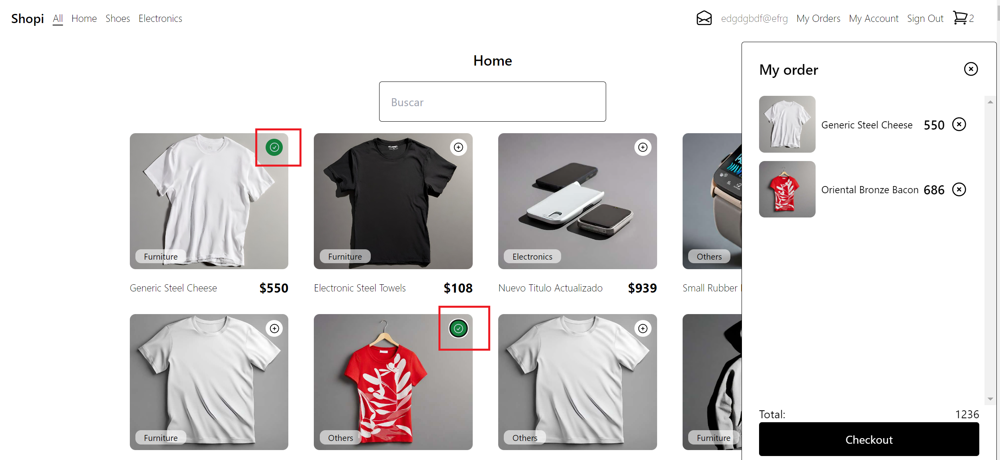
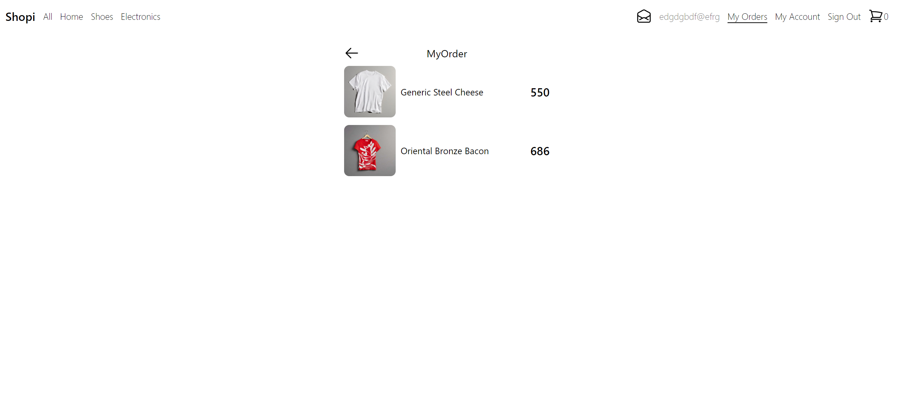
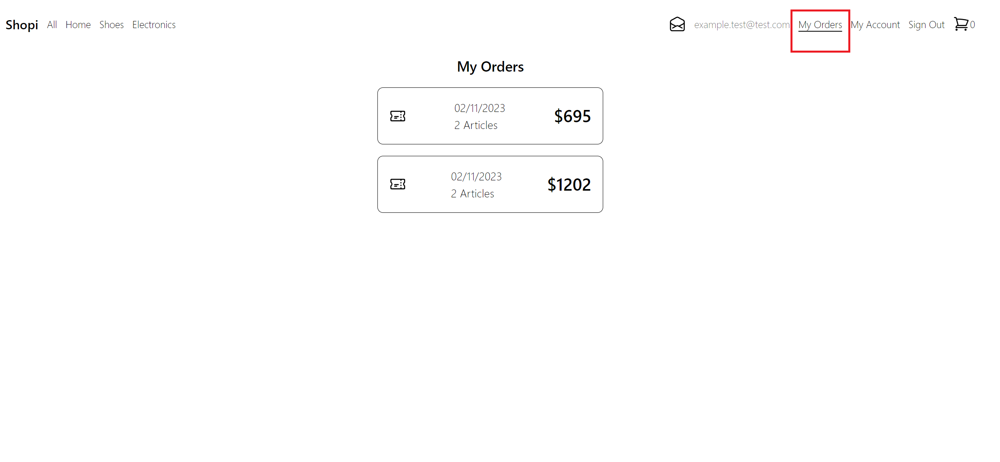
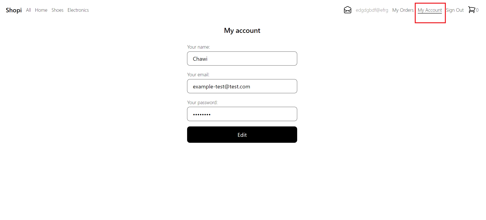

# 📝 eyCommerce

## Descripción
**eyCommerce** es una aplicación construida con Reactjs y Tailwind esencialmente, consume una Api de productos que se muestran en forma de Cards. 


Podemos guardar productos en el carrito, la informacion se almacena en localstorage y es compartida por los compnentes.


Dentro de "my orders" se guardará la información, producto y precio individual 


Tambien se visualiza la cantidad de articulos y los precios totales


Tiene un sistema de filtrado rapido para articulos populares


Por ultimo tiene una pantalla de login con redireccionamiento a home si el usuario no ha iniciado sesion



## Requisitos Previos
Antes de comenzar, asegúrate de tener instalado lo siguiente:
- [Node.js](https://nodejs.org/): Para ejecutar la aplicación.
- Navegador web moderno.

## Instalación
Sigue estos pasos para instalar y ejecutar **eyCommercer**:

1. Clona el repositorio:
   ```bash
   git clone git@github.com:nahwish/EyCommerce.git
   
2. Navega al directorio del proyecto:
  ```bash
  cd shopi

3. Instala las dependencias generales:
  ```bash
  npm install

6. Levanta el servidor
  ```bash
  npm start


¡Listo! Ahora puedes utilizar eyCommerce y simular una compra.


Contacto
Si tenés preguntas o comentarios, no dudes en ponerte en contacto con nosotros en [nadaro@outlook.com].# eyCommerce
